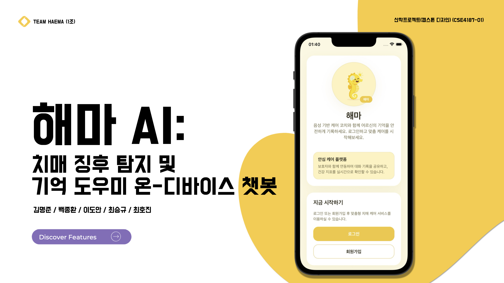

📱 해마 AI (HAEMA AI)
치매 징후 탐지 및 기억 도우미 온-디바이스 AI 챗봇
산학프로젝트(캡스톤 디자인) CSE4187-01 — TEAM HAEMA

🧠 “초기 치매 징후는 일상 속 말하기에서 가장 먼저 나타납니다.”
해마 AI는 고령층의 언어·음성 패턴, 대화 습관, 인지 게임 결과를 기반으로 치매 위험도를 추정하고 정서적 교감 기반 기억 보조까지 제공하는 올인원 헬스케어 앱입니다.

🔗 Repositories 바로가기
| Repository | 링크 / 설명 |
| --- | --- |
| HAEMA_Architecture | https://github.com/Haema-AI/HAEMA_Architecture — 🧠 3-1. HAEMA Memory Architecture 실험 코드 (L1→L2→L3 3단계 기억 구조, 메모리 최대 1/15 절감, KSC 2025 논문 제출) |
| Audio-Feature-Extraction | https://github.com/Haema-AI/Audio-Feature-Extraction — 치매 판정 모델용 음성·언어 지표 추출 |
| MLP_train_codes | https://github.com/Haema-AI/MLP_train_codes — 3-2. AI 기반 치매 위험도 예측 (DementiaBank 데이터, 지표 6종, 3-layer MLP, Acc 82%, ROC-AUC 0.8955, TFLite 최적화) |
| Haema_AI | https://github.com/Haema-AI/Haema_AI — 모바일 애플리케이션 코드 |

---

📚 1. 프로젝트 개요
- 병원 방문, 비용, 검사 주기, 지방 인프라 부족으로 지속 모니터링이 어려운 문제를 모바일 기반 AI로 해결
- 언어·음성 패턴(말 속도, 단어 다양성, 침묵 등) 변화를 일상 대화에서 포착해 초기 위험 신호 감지
- 기억 관리, 인지 게임, 보호자 리포트까지 한 번에 제공

---

🎯 2. 주요 목표
- AI 기반 초기 치매 징후 감지
  - DementiaBank 실발화 데이터, 언어·음성 지표 6종, 3-layer MLP 모델
- 개인 맞춤형 장기 기억 케어
  - 대화 저장→요약→기억 퀴즈 자동 생성, HAEMA Memory Architecture 활용
- 인지 기능 강화
  - K-MMSE 기반 카드 짝맞추기·순서기억 게임
- 보호자 연동 레포트
  - 발화 변화·게임 기록·위험도 추세 자동 분석/전송

---

🏗️ 3. 시스템 구성 / 구현

🧠 3-1. HAEMA Memory Architecture
- 3단계 기억 구조(L1 작업기억 → L2 일화기억 → L3 사실기억)를 모사
- 메모리 사용량을 베이스라인 대비 최대 1/15 감소, 응답 품질 유지
- KSC 2025 논문 제출 완료

🔍 3-2. AI 기반 치매 위험도 예측
- DementiaBank(University of Pittsburgh) 치매/정상 발화 데이터 사용
- 언어·음성 지표 6종 추출, 3-layer MLP 분류
- Accuracy 82%, ROC-AUC 0.8955, Mobile TFLite 최적화

🎮 3-3. 인지 기능 강화 게임
- K-MMSE 검사 항목 기반 설계
- 카드 짝맞추기, 순서 기억하기
- 인지능력 흐름을 통계로 시각화

🎤 3-4. 정서적 교감 챗봇 & 기억 보조
- 음성 기반 대화, AI가 먼저 질문해 대화를 이끌며 기억 회상 유도
- 하루 대화 자동 요약→일기화, 요약 기반 기억력 퀴즈 생성

📱 3-5. 고령층 친화 All-in-One 앱
- React Native 크로스플랫폼
- Supabase 백엔드 + Resend 이메일 연동
- 위험도 분석, 대화 통계, 게임 기록 저장 및 보호자 주기적 보고

---

🌟 4. 주요 차별점
1) 의학적 근거 기반 언어·음성 지표 분석
2) 실제 치매/정상 발화 학습 모델 적용
3) 인간 기억 구조를 모사한 메모리 아키텍처
4) 예측 + 기억 도우미 + 인지 게임 통합 제공
5) 보호자 연동으로 원격 상태 확인
6) 별도 하드웨어 불필요 — 스마트폰만으로 사용 가능
7) 일상 대화 형식으로 치료/진단 거부감 최소화

---

📈 5. 결과 및 성능
- Memory Architecture: 메모리 소비 최대 1/15 감소, Latency·정확도 유지
- 치매 위험도 모델: Accuracy 82%, ROC-AUC 0.8955 (Threshold 조정으로 민감도 향상 가능)

---

🚀 6. 향후 과제
- 발화 데이터 확충 및 지표 다양화
- 사용자별 지표 가중/동적 Threshold로 개인화된 위험도 계산 고도화
- 고령층 UI/UX 추가 개선(글자 크기·색 대비·터치 영역 등)
- 챗봇/게임 통계 기반 추가 예측 모델 탐색

---

🏆 7. 외부 성과
- 2025 서강 융합기술 경진대회 — 대상 & 특별상
- KSC 2025 논문 제출 완료(12/19 발표 예정)
- Dacon 새싹 해커톤 참가
- 일부 팀원 TOPCIT 응시

---

📂 8. 발표 자료
- `profile/docs/해마_프로젝트_최종_발표.pdf`

🔗 9. Repository
- https://github.com/Haema-AI/Haema_AI (시연 영상 포함)

🙌 10. 팀 구성
- 김명준 / 백종환 / 이도안 / 최승규 / 최호진
